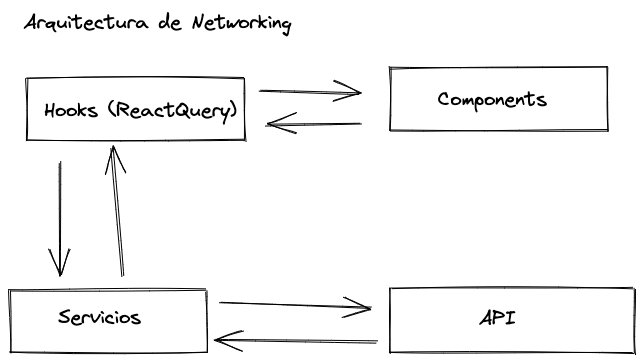

# Che, ¿hoy donamos?

Cliente web de `Che, ¿hoy donamos?`, realizado en [ReactJS](https://reactjs.org/).

## Colores

| Color           | Hex                                                              |
| --------------- | ---------------------------------------------------------------- |
| Primary         |  #ff2063 |
| Secondary       |  #73b8b2 |
| Complementary 1 |  #d79a9f |

## Demo

Insert gif or link to demo

## Tech Stack

React, ReactQuery, SASS + TailwindCSS

## Arquitectura

### Estructura del proyecto

```
.
├── docs/
├── public/
├── src
│   ├── assets/
│   ├── components/
│   ├── contexts/
│   ├── helpers/
│   ├── hooks/
│   ├── layouts/
│   ├── networking/
│   ├── pages/
│   ├── routers/
│   ├── sass/_variables.scss
│   ├── App.js
│   ├── index.js
├── .env
├── .gitignore
├── .prettierrc
├── craco.config.js
├── jsconfig.json
├── package-lock.json
├── package.json
├── README.md
└── tailwind.config.js
```

### Estructura de un componente

```
├── MyComponent
│ ├── index.js
│ ├── MyComponent.js
│ ├── MyComponent.module.scss
```

Cada componente usara clases de TailwindCSS para sus estilos, en el caso de que sea necesario agregar estilos especificos se creara un archivo con el siguiente formato `NombreDelComponente.module.scss`

Si se quiere dividir el componente en partes mas pequeñas para mejorar la lectura del codigo, se pueden agregar en la carpeta del componente si es que no van a ser usado fuera del mismo.

El archivo `index.js` debería exportar `default` el componente reutilizable que va a ser consumido por otros recursos de la aplicación.

### Arquitectura de Networking



Son los `Servicios` quienes gestionan la comunicación con la `API`, siendo los responsables de los métodos HTTP a usar en cada petición, serializar los datos para que sean semánticos y los encargados de proveer a la `API` los datos en el formato que los necesita (ej. JWT en la cabecera de las peticiones).

Le dimos la responsabilidad de gestionar el estado del servidor (API/Backend) del lado del cliente(Frontend) a React Query, y decidimos utilizarlo a través de `custom hooks` los cuales usan los `hooks` que nos provee React Query. Estos `hooks` se comunican con los `Servicios` y mantienen el estado de la aplicación actualizado y sincronizado con el estado del servidor.

Nuestros `componentes` se comunicaran con el servidor a través de los `hooks` quienes a su vez harán que nuestros componentes se actualicen para que los datos que mostramos en ellos estén sincronizados con el servidor y nos permitirán realizar cambios en el también.

## Levantar Servicio Localmente

- Clonar el repositorio

```bash
  git clone https://github.com/Anima-Tec/2021_Proyecto_Integrador_Equipo_3-Frontend.git
```

- Ir al directorio del proyecto

```bash
  cd 2021_Proyecto_Integrador_Equipo_3-Frontend
```

- Crear un archivo `.env` donde esten las variables de entorno especificadas en el `.env.example`

- Instalar las dependencias, utilizando npm

```bash
  npm install
```

- Levantar el servidor

```bash
  npm start
```

## Levantar Servicio Produción

- Clonar el repositorio

```bash
  git clone https://github.com/Anima-Tec/2021_Proyecto_Integrador_Equipo_3-Frontend.git
```

- Ir al directorio del proyecto

```bash
  cd 2021_Proyecto_Integrador_Equipo_3-Frontend
```

- Crear un archivo `.env` donde esten las variables de entorno especificadas en el `.env.example`

- Instalar las dependencias, utilizando npm

```bash
  npm install
```

- Crear una version de producion en la carpeta `build`

```bash
  npm run build
```

## Authors

- [Nicolás Machado da Silva](https://www.github.com/nicocadq)
- [Alejandro Gonzalez](https://github.com/alejandroGonGon)
- [Lautaro Pardo](https://github.com/LautaroPardo)
- [Facundo Correa](https://github.com/facorrea700)
